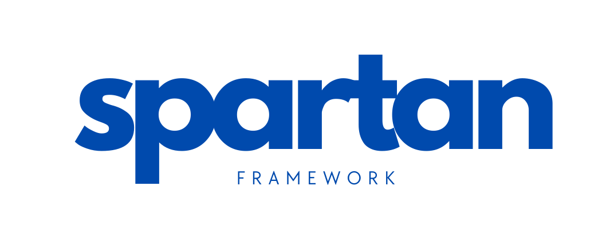

<p align="center"></p>

# Spartan Framework

## About
Spartan Framework—"the Swiss Army knife for serverless development"—is a powerful scaffold that simplifies the creation of serverless applications on AWS. It streamlines your development process and ensures code consistency, allowing you to build scalable and efficient applications on AWS with ease.

#### Spartan Framework is versatile and can be used to efficiently develop:
- API
- Workflows or State Machines
- ETL Pipelines
- Containerized Microservices

Fully tested in AWS, Spartan Framework is also compatible with other cloud providers like Azure and GCP, making it a flexible choice for a wide range of serverless applications.


## Installation
1. To install the spartan command line tool
```bash
pip install python-spartan
```

2. Try
```bash
spartan --help
```

## Usage
1. Install all the required packages
```bash
python -m venv .venv
pip install -r requirements.txt
```
2. Copy the .env.example to .env

3. Configure the migration
```bash
spartan migrate init -d sqlite
```

4. Create all the tables
```bash
spartan migrate upgrade
```

5. Insert dummy data
```bash
spartan db seed
```

6. Then run it using the following command
```bash
spartan serve
```

## Documentation

Comprehensive documentation is available and built with Sphinx. To build and view the documentation:

```bash
# Install documentation dependencies (if not already installed)
make install

# Build the documentation
make build

# Open documentation in browser (macOS)
make open

# Or serve documentation locally at http://localhost:8000
make serve
```

The documentation includes:
- **Installation Guide**: Step-by-step setup instructions
- **Quick Start**: Get up and running quickly
- **API Reference**: Complete auto-generated API documentation
- **Contributing Guide**: How to contribute to the project

### Documentation Commands

- `make help` - Show all available documentation commands
- `make html` - Build HTML documentation
- `make clean` - Clean build directory
- `make build` - Clean and build documentation
- `make serve` - Serve documentation locally
- `make open` - Open documentation in browser (macOS)
- `make livehtml` - Build with auto-reload for development
- `make linkcheck` - Check for broken external links

## Testing
```bash
pytest
```

## Development

### Quick Setup for Contributors

For new contributors, run this command to set up your development environment:

```bash
make setup
```

This will:
- Install all development dependencies via Poetry
- Set up pre-commit hooks
- Run initial code quality checks

### Development Commands

The project uses Make for common development tasks:

```bash
# Setup development environment
make setup                 # Quick setup for new developers
make setup-precommit      # Install and setup pre-commit hooks only

# Code Quality
make format               # Format code with black and isort
make lint                 # Run linting checks (flake8, bandit)
make precommit           # Run pre-commit on all files
make precommit-fix       # Run pre-commit with auto-fix
make quality             # Run all quality checks (format, lint, test)

# Testing
make test                # Run tests
make test-cov            # Run tests with coverage report

# Maintenance
make clean-cache         # Clean Python cache files
make update-hooks        # Update pre-commit hooks to latest versions
```

### Pre-commit Hooks

This project uses pre-commit hooks to ensure code quality. The hooks will run automatically on every commit and include:

- **Code Formatting**: Black, isort, autoflake
- **Linting**: Flake8, Bandit security checks
- **Quality Checks**: YAML/JSON validation, trailing whitespace, etc.
- **Testing**: Pytest runs on commit

To skip pre-commit for a specific commit (not recommended):
```bash
git commit --no-verify
```

### Development Workflow

1. Set up your development environment: `make setup`
2. Make your changes
3. Run quality checks: `make quality`
4. Commit your changes (pre-commit hooks will run automatically)
5. Push your changes

## Changelog

Please see [CHANGELOG](CHANGELOG.md) for more information on what has changed recently.

## Contributing

Please see [CONTRIBUTING](./docs/CONTRIBUTING.md) for details.

## Security Vulnerabilities

Please review [our security policy](../../security/policy) on how to report security vulnerabilities.

## Credits

- [Sydel Palinlin](https://github.com/nerdmonkey)
- [All Contributors](../../contributors)

## License

The MIT License (MIT). Please see [License File](LICENSE) for more information.
